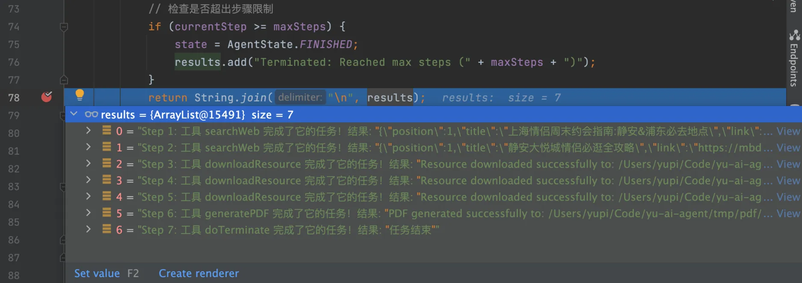
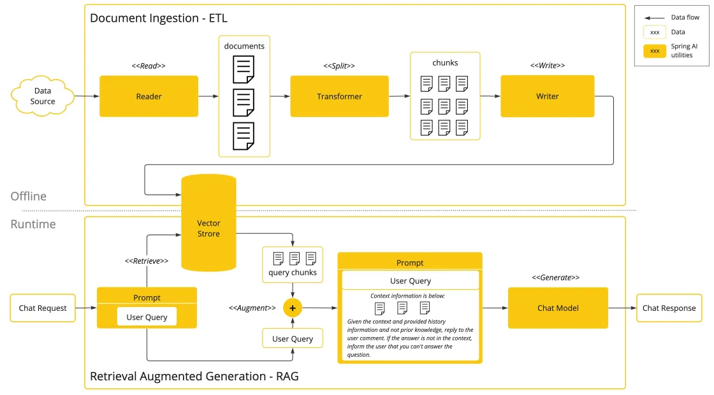
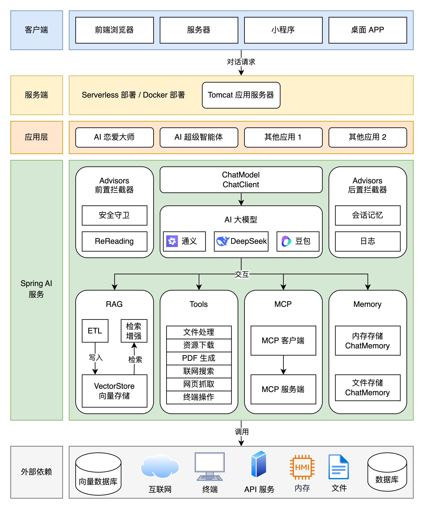

# AI 超级智能体

> 作者：[LongMiao](https://github.com/LM20230311)
>
>
> ⭐️ 学习AI智能体中
> 
> ⭐️ 目标：打造针对特定场景优化的智能体
> 

## 项目是什么？

这是一套以 **AI 开发实战** 为核心的项目，将通过开发 **AI 恋爱大师应用 + 拥有自主规划能力的超级智能体**。

`AI 恋爱大师应用` 可以依赖 AI 大模型解决用户的情感问题，支持多轮对话、基于自定义知识库进行问答、自主调用工具和 MCP 服务完成任务，比如调用地图服务获取附近地点并制定约会计划。

此外基于 ReAct 模式的 `自主规划智能体 LongManus` ，可以利用网页搜索、资源下载和 PDF 生成工具，帮用户制定完整的约会计划并生成文档：

## 项目思考

- AI 应用平台的使用
- 接入 AI 大模型
- AI 开发框架（Spring AI + LangChain4j）
- AI 大模型本地部署
- Prompt 工程和优化技巧
- 多模态特性
- Spring AI 核心特性：如自定义拦截器、上下文持久化、结构化输出
- RAG 知识库和向量数据库
- Tool Calling 工具调用
- MCP 模型上下文协议和服务开发
- AI 智能体 Manus 原理和自主开发
- AI 服务化和 Serverless 部署

## 技术

项目以 Spring AI 开发框架为核心，涉及到多种主流 AI 客户端和工具库的运用。

- Java 21 + Spring Boot 3 框架
- ⭐️ Spring AI + LangChain4j
- ⭐️ RAG 知识库
- ⭐️ PGvector 向量数据库
- ⭐ Tool Calling ️工具调用 
- ⭐️ MCP 模型上下文协议
- ⭐️ ReAct Agent 智能体构建
- ⭐️ Serverless 计算服务
- ⭐️ AI 大模型开发平台百炼
- ⭐️ Cursor AI 代码生成 + MCP
- 第三方接口：如 SearchAPI / Pexels API
- Ollama 大模型部署
- Kryo 高性能序列化
- Jsoup 网页抓取
- iText PDF 生成
- Knife4j 接口文档

RAG 核心特性实战：

项目架构设计图：

